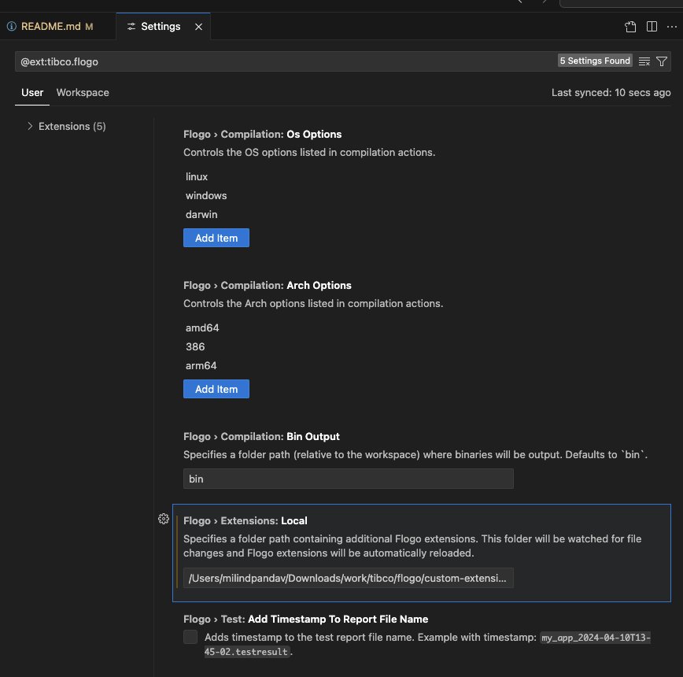

# Flogo Custom Extensions

This repository hosts a collection of custom activities and triggers developed for TIBCO Flogo, extending its capabilities to meet specific integration needs.

## Table of Contents

* [Overview](#overview)
* [Project Structure](#project-structure)
* [Custom Activities](#custom-activities)
    * [Write Log Activity](#write-log-activity)
    * [Schema Transform Activities](#schema-transform-activities)
        * [Avro Schema Transform Activity](#avro-schema-transform-activity)
        * [JSON Schema Transform Activity](#json-schema-transform-activity)
        * [XSD Schema Transform Activity](#xsd-schema-transform-activity)
    * [XML Filter Activity](#xml-filter-activity)
* [Custom Triggers](#custom-triggers)
    * [PostgreSQL Listener Trigger](#postgresql-listener-trigger)
* [Examples](#examples)
* [Usage](#usage)
* [Contributing](#contributing)
* [License](#license)

## Overview

TIBCO Flogo is an ultra-lightweight integration framework ideal for edge computing and serverless applications. While Flogo provides a rich set of built-in activities and triggers, this repository contains custom-built extensions designed to address unique integration patterns and functionalities required by our projects.

These extensions are intended to be easily integrated into your Flogo applications, allowing you to leverage their features within your flows.

## Project Structure

<<<<<<< Updated upstream
```
├── activity/
│   ├── schema-transform/
│   │   ├── avroschematransform/     # Avro to JSON Schema/XSD converter
│   │   ├── jsonschematransform/     # JSON Schema to XSD/Avro converter
│   │   └── xsdschematransform/      # XSD to JSON Schema/Avro converter
│   ├── write-log/                   # Advanced logging with ECS compliance
│   └── xmlfilter/                   # XML filtering with XPath conditions
├── trigger/
│   └── postgreslistener/            # PostgreSQL NOTIFY listener
└── examples/
    └── schema_converter/             # Schema transformation API example
```

## Custom Activities

The `activity` folder contains the following custom Flogo activities:
=======
| Component | Version | Type | Description |
|-----------|---------|------|-------------|
| [PostgreSQL Listener](trigger/postgreslistener/) | 0.1.0 | Database | Listen for PostgreSQL NOTIFY messages on specified channels |
| [SSE Trigger](sse/trigger/) | 1.0.0 | Real-time | Server-Sent Events trigger for streaming data to web clients |

## 🚀 Quick Start

Clone the repository. 

### Usage in Flogo
1. Navigate to the specific component directory
2. Copy the extension source code to your local Flogo extensions directory
3. Configure the extension path in Flogo VSCode extension settings
4. Use the components in your Flogo flows



## 📚 Examples
>>>>>>> Stashed changes

### Write Log Activity

<<<<<<< Updated upstream
This activity provides structured logging with OpenTracing/OpenTelemetry integration, ECS (Elastic Common Schema) compliance, field filtering, and sensitive data masking capabilities. It offers advanced formatting options for enterprise-grade logging requirements, including automatic trace correlation and standardized field mapping.

### Schema Transform Activities

A comprehensive suite of schema transformation activities that enable interoperability between different data formats:

#### Avro Schema Transform Activity
Transforms Avro schemas to JSON Schema and/or XSD formats, providing flexible conversion capabilities with support for multiple output formats simultaneously.

#### JSON Schema Transform Activity  
Transforms JSON Schema to XSD and Avro schema formats, enabling bidirectional schema conversion with comprehensive support for JSON Schema features including unions, conditional schemas, and validation constraints.
=======

>>>>>>> Stashed changes

#### XSD Schema Transform Activity
Provides comprehensive XSD (XML Schema Definition) transformation capabilities, supporting conversion to JSON Schema and Avro Schema formats with extensive configuration options for handling complex XSD features and namespace management.

### XML Filter Activity

<<<<<<< Updated upstream
Filters XML content based on XPath expressions with support for multiple conditions and logical operators (AND/OR). This activity evaluates XML documents against specified XPath conditions and returns match results, enabling sophisticated XML content filtering within Flogo flows.

## Custom Triggers
=======
>>>>>>> Stashed changes

The `trigger` folder currently holds the following custom Flogo trigger:

### PostgreSQL Listener Trigger

This trigger listens for PostgreSQL NOTIFY messages on specified channels, enabling event-driven architectures built around PostgreSQL database notifications. It can be configured with database connection parameters and supports real-time message processing, making it ideal for reactive applications that respond to database-level events.

## Examples

The `examples` folder provides practical implementations demonstrating the usage of our custom extensions:

* **Schema Converter API:** A comprehensive Flogo application showcasing the usage of multiple schema transformation activities (JSON Schema, XSD, and Avro transformations) in an integrated REST API format.

These examples serve as a guide to help you quickly understand and implement the custom activities in your own Flogo projects.

## Usage

To use these custom extensions in your Flogo application:

1.  **Clone this repository:**
    ```bash
    git clone https://github.com/mpandav-tibco/flogo-custom-extensions.git
    ```
2.  **Install the extensions:**
    * Navigate into the `activity` or `trigger` directory of the specific extension you want to use.
    * Copy the extension source code to specific directory on your installation.
    * Provide that director url within Flogo VSCode extension -> Settings -> Flogo › Extensions: Local [Steps are documented in official docs](https://docs.tibco.com/pub/flogo-vscode/1.2.0/doc/html/Default.htm#flogo-vscode-user-guide/using-extensions/Uploading_Extensions.htm?).
    * 

3.  **Build your Flogo application:**
    * After installing the extensions, you can build your Flogo application. The custom extensions will be bundled with your application.

For detailed instructions on building and running Flogo applications, refer to the [official TIBCO Flogo documentation](https://docs.tibco.com/pub/flogo-vscode/1.2.0/doc/html/Default.htm).

## Contributing

We welcome contributions to this repository! If you have an idea for a new extension, find a bug, or want to improve an existing one, please feel free to:

1.  Fork the repository.
2.  Create a new branch (`git checkout -b feature/your-feature-name`).
3.  Make your changes.
4.  Commit your changes (`git commit -am 'Add new feature'`).
5.  Push to the branch (`git push origin feature/your-feature-name`).
6.  Create a new Pull Request.

Please ensure your code adheres to Flogo's extension development guidelines and includes appropriate tests.

## License

This project is licensed under the [MIT License](LICENSE) - see the `LICENSE` file for details.


