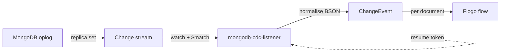

# MongoDB CDC Listener Trigger

Native **Change Data Capture** for MongoDB, implemented as a TIBCO Flogo custom trigger. It uses MongoDB
**change streams** to stream document-level `insert`, `update`, `replace`, and `delete` changes in real time
— **no polling, no tailing the oplog manually, and no application changes** on the database.

A Flogo flow is fired once per captured change, with the full document, the changed fields, an optional
document pre-image, and the resume token for durable restarts.

---

## Why change streams 

Change streams are MongoDB's official CDC API. They sit on top of the replica-set oplog and provide:

- **Ordered, at-least-once** delivery of every committed change.
- **Resumability** via a *resume token* — the stream can be restarted exactly where it left off after a
  disconnect or process restart, with no missed events.
- **Filtering and lookups** server-side (operation-type filtering, full-document lookup, pre-images).

---

## Requirements

Change streams require a **replica set** or **sharded cluster** — they are not available on a standalone
`mongod`. A single-node replica set is sufficient for development.

To receive the document **pre-image** (`oldData`) on updates and deletes, enable pre/post images on the
collection (MongoDB 6.0+):

```javascript
db.runCommand({ collMod: "my_collection", changeStreamPreAndPostImages: { enabled: true } })
```

> Docker quick start (single-node replica set):
> ```bash
> docker run -d --name mongo-cdc -p 27017:27017 mongo:7 --replSet rs0 --bind_ip_all
> docker exec mongo-cdc mongosh --eval 'rs.initiate()'
> ```
> Connect with `mongodb://localhost:27017/?directConnection=true`.

---

## Configuration

### Connection settings

Provide **either** a full `connectionURI` **or** `host`/`port` (plus optional credentials).

| Setting | Type | Required | Default | Description |
|---|---|---|---|---|
| `connectionURI` | string | either this or host | | Full `mongodb://` / `mongodb+srv://` URI (takes precedence) |
| `host` | string | either this or URI | `localhost` | MongoDB host |
| `port` | integer | no | `27017` | MongoDB port |
| `username` | string | no | | Authentication user |
| `password` | string | no | | Authentication password |
| `authSource` | string | no | `admin` | Authentication database |
| `authMechanism` | string | no | | Auth mechanism (e.g. `SCRAM-SHA-256`) |
| `replicaSet` | string | no | | Replica set name |
| `tlsConfig` | boolean | no | `false` | Enable TLS/SSL |
| `tlsCAFile` | string | no | | CA certificate path |
| `tlsCertificateKeyFile` | string | no | | Client certificate + key (PEM) for mTLS |
| `tlsInsecure` | boolean | no | `false` | Skip certificate/hostname verification |
| `connectionTimeout` | integer | no | `30` | Connection timeout (seconds) |
| `maxRetryAttempts` | integer | no | `5` | Reconnect attempts after a stream failure (negative = infinite) |
| `retryDelay` | string | no | `5s` | Delay between reconnect attempts (Go duration) |

### Handler settings

| Setting | Type | Required | Default | Description |
|---|---|---|---|---|
| `database` | string | no | | Database to watch (empty = whole deployment) |
| `collection` | string | no | | Collection to watch (empty = whole database) |
| `operationTypes` | string | no | `ALL` | Comma-separated: `ALL`, or any of `INSERT`, `UPDATE`, `REPLACE`, `DELETE` |
| `fullDocument` | string | no | `updateLookup` | `default`, `updateLookup`, `whenAvailable`, `required` |
| `fullDocumentBeforeChange` | string | no | `off` | `off`, `whenAvailable`, `required` (pre-image) |
| `batchSize` | integer | no | | Change stream cursor batch size |
| `maxAwaitTime` | string | no | | Max server wait for new changes (Go duration) |

**Watch scope** is chosen automatically:

- `collection` set → watch that collection.
- `database` set (no collection) → watch the whole database.
- neither set → watch the whole deployment.

---

## Trigger output

| Field | Type | Description |
|---|---|---|
| `eventID` | string | Unique event identifier |
| `eventType` | string | `INSERT`, `UPDATE`, `REPLACE`, `DELETE`, `DROP`, `RENAME`, `INVALIDATE` |
| `database` | string | Source database name |
| `collection` | string | Source collection name |
| `documentKey` | object | Identifier of the changed document (typically `{_id}`) |
| `timestamp` | string | Cluster time of the change (RFC3339) |
| `data` | object | Full document (`INSERT`/`REPLACE`; `UPDATE` with lookup enabled) |
| `oldData` | object | Document pre-image (requires `fullDocumentBeforeChange`) |
| `updatedFields` | object | Fields changed by an `UPDATE` |
| `removedFields` | array | Fields removed by an `UPDATE` |
| `resumeToken` | string | Resume token for restarting the stream |
| `correlationID` | string | Correlation ID for tracing |

BSON values are normalised to JSON-friendly types: `ObjectId` becomes its hex string, dates become RFC3339
strings, binary becomes base64, `Decimal128` becomes its string form, and nested documents/arrays are
converted recursively.

---

## How it works



1. On start, the trigger connects and opens a change stream at the configured scope, applying a `$match`
   pipeline for the selected operation types and the chosen `fullDocument` / pre-image options.
2. Each change document is normalised into a `ChangeEvent` and dispatched to the flow.
3. The latest resume token is tracked so the stream can be resumed after a reconnect.

---

## Testing

A live integration test (gated by an environment variable so it is skipped in normal unit runs) exercises
`insert`, `update`, and `delete` against a real replica set and asserts the captured events, including the
pre-image `oldData`:

```bash
# Start a single-node replica set (see Docker quick start above), then:
MONGO_CDC_IT=1 \
MONGO_CDC_TEST_URI="mongodb://localhost:57017/?directConnection=true" \
go test -run TestMongoDBCDCIntegration -v ./...
```

---

## Notes and limitations

- Change streams require a replica set or sharded cluster.
- `oldData` (pre-image) requires `changeStreamPreAndPostImages` enabled on the collection (MongoDB 6.0+)
  and `fullDocumentBeforeChange` set to `whenAvailable` or `required`.
- On `update`, `data` is only populated when `fullDocument` is `updateLookup` (or `whenAvailable`/`required`);
  otherwise only `updatedFields`/`removedFields` are provided.
- The resume token is currently tracked in memory for in-process resumption. For durable cross-restart
  resumption, persist `resumeToken` from the flow and supply it on restart.

> **Studio build note:** when importing this extension to build a Flogo app with the VS Code Flogo
> tooling, the app's embedded `contrib` `s3location` suffix must match this directory basename
> (`mongodb-cdc-listener`). A mismatch surfaces as a misleading
> *"extensions &lt;name&gt; do not contain a go.mod file"* error at build time.
