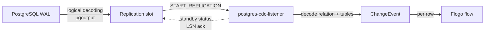

# PostgreSQL CDC Listener Trigger

Native **Change Data Capture** for PostgreSQL, implemented as a TIBCO Flogo custom trigger. It streams
row-level `INSERT`, `UPDATE`, and `DELETE` changes directly from the PostgreSQL **write-ahead log (WAL)**
using **logical replication** and the built-in `pgoutput` plugin — **no polling, no source-side triggers,
and no application changes** on the database.

A Flogo flow is fired once per captured change, with the new row image, the previous row image (for
updates/deletes), and full transaction metadata (LSN, XID, commit timestamp).

---

## Why logical replication

Unlike a `LISTEN`/`NOTIFY` or polling approach, logical replication:

- Reads committed changes straight from the WAL, so it captures **every** change with **exact ordering**.
- Is **durable and resumable** — a replication *slot* remembers the last acknowledged position server-side,
  so the listener can restart and continue exactly where it left off with **no missed or duplicated** events.
- Adds **negligible load** to the source database (it is the same mechanism physical replicas use).

---

## Requirements

The PostgreSQL server must have logical replication enabled:

```conf
# postgresql.conf
wal_level = logical
max_replication_slots = 10   # >= number of concurrent slots
max_wal_senders = 10         # >= number of concurrent replication connections
```

The connecting user needs the `REPLICATION` attribute:

```sql
ALTER ROLE my_user WITH REPLICATION;
```

To capture the **full previous row image** on `UPDATE`/`DELETE` (not just the primary key), set:

```sql
ALTER TABLE my_table REPLICA IDENTITY FULL;
```

> Docker quick start:
> ```bash
> docker run -d --name pg-cdc -p 5432:5432 \
>   -e POSTGRES_USER=cdc -e POSTGRES_PASSWORD=cdcpass -e POSTGRES_DB=cdcdb \
>   postgres:16 -c wal_level=logical -c max_replication_slots=10 -c max_wal_senders=10
> ```

---

## Configuration

### Connection settings

| Setting | Type | Required | Default | Description |
|---|---|---|---|---|
| `host` | string | yes | `localhost` | PostgreSQL server host |
| `port` | integer | yes | `5432` | PostgreSQL server port |
| `user` | string | yes | | Database user with the `REPLICATION` attribute |
| `password` | string | yes | | Database password |
| `databaseName` | string | yes | | Database to replicate changes from |
| `tlsConfig` | boolean | no | `false` | Enable TLS/SSL for the connection |
| `sslMode` | string | no | `require` | `require`, `verify-ca`, or `verify-full` |
| `sslCA` | string | no | | CA certificate path (`verify-ca` / `verify-full`) |
| `sslCert` | string | no | | Client certificate path (optional mTLS) |
| `sslKey` | string | no | | Client private key path (optional mTLS) |
| `connectionTimeout` | integer | no | `30` | Connection timeout (seconds) |
| `maxRetryAttempts` | integer | no | `5` | Reconnect attempts after a stream failure (negative = infinite) |
| `retryDelay` | string | no | `5s` | Delay between reconnect attempts (Go duration) |
| `standbyMessageTimeout` | string | no | `10s` | Interval for standby status (LSN ack) updates |

### Handler settings

| Setting | Type | Required | Default | Description |
|---|---|---|---|---|
| `slotName` | string | yes | | Logical replication slot name (`[a-z0-9_]`) |
| `publicationName` | string | yes | | Publication that defines which tables are captured |
| `createSlotIfNotExists` | boolean | no | `true` | Auto-create the slot if missing |
| `temporarySlot` | boolean | no | `false` | Use a temporary slot (dropped on disconnect; no durable resume) |
| `createPublicationIfNotExists` | boolean | no | `false` | Auto-create the publication if missing |
| `tables` | array | no | | Tables for auto-created publication (`schema.table`); empty = `FOR ALL TABLES` |
| `eventTypes` | string | no | `ALL` | Comma-separated: `ALL`, or any of `INSERT`, `UPDATE`, `DELETE` |
| `includeTransactionMarkers` | boolean | no | `false` | Also emit `BEGIN`/`COMMIT` marker events |

> **Publication and slot** can be created manually for tighter control:
> ```sql
> CREATE PUBLICATION my_pub FOR TABLE public.orders, public.customers;
> -- the slot is created automatically by the trigger, or manually:
> SELECT pg_create_logical_replication_slot('my_slot', 'pgoutput');
> ```

---

## Trigger output

| Field | Type | Description |
|---|---|---|
| `eventID` | string | Unique event identifier |
| `eventType` | string | `INSERT`, `UPDATE`, `DELETE`, `TRUNCATE`, `BEGIN`, `COMMIT` |
| `database` | string | Source database name |
| `schema` | string | Source schema (namespace) |
| `table` | string | Source table name |
| `timestamp` | string | Transaction commit timestamp (RFC3339) |
| `data` | object | New row image, keyed by column name (`INSERT`/`UPDATE`) |
| `oldData` | object | Previous row image (`UPDATE`/`DELETE`; full row needs `REPLICA IDENTITY FULL`) |
| `lsn` | string | WAL log sequence number of the change |
| `xid` | integer | Transaction ID |
| `correlationID` | string | Correlation ID for tracing |

Column values are decoded to native JSON types based on the PostgreSQL column type (booleans, integers,
and floating-point numbers are emitted as typed values; other types are emitted as strings).

---

## How it works



1. On start, the trigger (optionally) creates the publication and replication slot, then issues
   `START_REPLICATION ... (proto_version '1', publication_names '<publication>')`.
2. It consumes the `pgoutput` message stream: `Relation` messages describe table schemas (cached),
   `Begin`/`Commit` bracket transactions, and `Insert`/`Update`/`Delete`/`Truncate` carry the row data.
3. Each row change is turned into a `ChangeEvent`, filtered by `eventTypes`, and dispatched to the flow.
4. The listener periodically sends a **standby status update** acknowledging the last flushed LSN so the
   server can recycle WAL and the stream can resume after a restart.

---

## Testing

A live integration test (gated by an environment variable so it is skipped in normal unit runs) spins up
changes against a real PostgreSQL instance and asserts that `INSERT`, `UPDATE`, and `DELETE` are captured
with correctly typed values:

```bash
# Start a PostgreSQL container with logical replication enabled, then:
PG_CDC_IT=1 \
PG_CDC_TEST_HOST=localhost PG_CDC_TEST_PORT=5432 \
PG_CDC_TEST_USER=cdc PG_CDC_TEST_PASSWORD=cdcpass PG_CDC_TEST_DB=cdcdb \
go test -run TestPostgresCDCIntegration -v ./...
```

---

## Notes and limitations

- Logical replication decodes **committed** transactions; changes become visible after `COMMIT`.
- `TRUNCATE` is reported as a table-level event (no row data).
- Large field values that are unchanged and stored out-of-line (TOAST) are omitted from `data` on
  `UPDATE` unless the column actually changed — this is a PostgreSQL protocol behavior, not a limitation of
  the trigger.
- One replication slot supports a single active connection. Use distinct slot names for independent
  consumers.

> **Studio build note:** when importing this extension to build a Flogo app with the VS Code Flogo
> tooling, the app's embedded `contrib` `s3location` suffix must match this directory basename
> (`postgres-cdc-listener`). A mismatch surfaces as a misleading
> *"extensions &lt;name&gt; do not contain a go.mod file"* error at build time.
