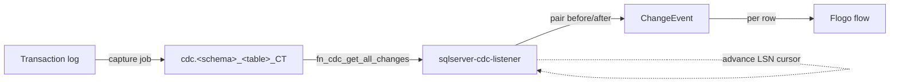

# SQL Server CDC Listener Trigger

Native **Change Data Capture** for Microsoft SQL Server, implemented as a TIBCO Flogo custom trigger. It
reads committed `INSERT`, `UPDATE`, and `DELETE` changes from SQL Server's built-in **CDC change tables**,
tracking progress by **log sequence number (LSN)** — **no source-side triggers and no application changes**
on the database.

A Flogo flow is fired once per captured row change, with the new row image, the previous row image (for
updates and deletes), and the commit LSN and timestamp.

---

## Why SQL Server CDC

SQL Server CDC is a first-class engine feature. A capture job reads the transaction log and records row
changes into per-table change tables. Consuming those tables:

- Captures **every committed change** in **commit order**, including the **before and after images** of
  updates.
- Is **durable and resumable** — progress is tracked by LSN, so the listener can restart and continue from
  the last processed LSN with no missed changes (within the CDC retention window).
- Adds no triggers to the source tables; the capture is driven off the transaction log.

> Because SQL Server exposes CDC as queryable change tables (not a push stream), this trigger **polls** the
> change tables at a configurable interval. The capture job itself populates the tables asynchronously, so
> there is a small, inherent latency between commit and delivery.

---

## Requirements

CDC requires **SQL Server Agent** to be running (the capture and cleanup jobs are Agent jobs). Enable CDC on
the database and on each table:

```sql
-- once per database
EXEC sys.sp_cdc_enable_db;

-- once per table
EXEC sys.sp_cdc_enable_table
    @source_schema = N'dbo',
    @source_name   = N'orders',
    @role_name     = NULL,
    @supports_net_changes = 0;
```

> Docker quick start:
> ```bash
> docker run -d --name mssql-cdc -p 1433:1433 \
>   -e "ACCEPT_EULA=Y" -e "MSSQL_SA_PASSWORD=Str0ng!Passw0rd" \
>   -e "MSSQL_AGENT_ENABLED=true" -e "MSSQL_PID=Developer" \
>   mcr.microsoft.com/mssql/server:2022-latest
> ```
> `MSSQL_AGENT_ENABLED=true` is required — without the Agent, change tables are never populated.

---

## Configuration

### Connection settings

| Setting | Type | Required | Default | Description |
|---|---|---|---|---|
| `host` | string | yes | `localhost` | SQL Server host |
| `port` | integer | yes | `1433` | SQL Server port |
| `user` | string | yes | | Database user with access to the CDC change tables |
| `password` | string | yes | | Database password |
| `databaseName` | string | yes | | Database with CDC enabled |
| `encrypt` | string | no | `disable` | `disable`, `false`, `true`, or `strict` |
| `trustServerCertificate` | boolean | no | `false` | Trust the server cert without CA validation |
| `certificate` | string | no | | Path to the server CA certificate (PEM) |
| `connectionTimeout` | integer | no | `30` | Connection timeout (seconds) |
| `pollInterval` | string | no | `2s` | How often to poll the change tables (Go duration) |
| `maxRetryAttempts` | integer | no | `5` | Reconnect attempts after a failure (negative = infinite) |
| `retryDelay` | string | no | `5s` | Delay between reconnect attempts (Go duration) |

### Handler settings

| Setting | Type | Required | Default | Description |
|---|---|---|---|---|
| `schema` | string | no | `dbo` | Source table schema |
| `table` | string | yes | | Source table name (CDC must be enabled) |
| `captureInstance` | string | no | `<schema>_<table>` | CDC capture instance name |
| `eventTypes` | string | no | `ALL` | Comma-separated: `ALL`, or any of `INSERT`, `UPDATE`, `DELETE` |
| `startFromBeginning` | boolean | no | `false` | Replay all retained changes from the minimum LSN on start |

---

## Trigger output

| Field | Type | Description |
|---|---|---|
| `eventID` | string | Unique event identifier |
| `eventType` | string | `INSERT`, `UPDATE`, `DELETE` |
| `database` | string | Source database name |
| `schema` | string | Source schema name |
| `table` | string | Source table name |
| `timestamp` | string | Commit time of the change (RFC3339) |
| `data` | object | New row image, keyed by column name (`INSERT`/`UPDATE`) |
| `oldData` | object | Previous row image (`UPDATE`/`DELETE`) |
| `lsn` | string | Commit LSN (hex) of the change |
| `seqVal` | string | Sequence value within the transaction (hex) |
| `operation` | integer | Raw CDC operation code (`1`=delete, `2`=insert, `3`=update-before, `4`=update-after) |
| `correlationID` | string | Correlation ID for tracing |

Column values are returned using their natural JSON types where possible; binary values are hex-encoded
(`0x...`) and datetime values are formatted as RFC3339.

---

## How it works



1. On start, the trigger verifies CDC is enabled and resolves the capture instance
   (`<schema>_<table>` by default).
2. On each poll it reads the current max LSN (`sys.fn_cdc_get_max_lsn`) and queries
   `cdc.fn_cdc_get_all_changes_<instance>(from_lsn, to_lsn, 'all update old')` for the new range.
3. Rows are ordered by LSN and sequence; update before-images (op 3) are paired with the following
   after-image (op 4) to populate `data`/`oldData`.
4. The LSN cursor is advanced past the consumed range so the next poll only reads new changes.

---

## Testing

A live integration test (gated by an environment variable so it is skipped in normal unit runs) enables CDC
on a test table and asserts that `INSERT`, `UPDATE`, and `DELETE` are captured, including the update
before-image:

```bash
# Start a SQL Server container with the Agent enabled (see Docker quick start), then:
MSSQL_CDC_IT=1 \
MSSQL_CDC_TEST_HOST=localhost MSSQL_CDC_TEST_PORT=1433 \
MSSQL_CDC_TEST_USER=sa MSSQL_CDC_TEST_PASSWORD='Str0ng!Passw0rd' \
go test -run TestSQLServerCDCIntegration -v -timeout 360s ./...
```

---

## Notes and limitations

- CDC requires SQL Server Agent; the change tables are populated asynchronously by the capture job, so a
  small commit-to-delivery latency is expected.
- Changes are retained only for the CDC retention window (default 3 days). `startFromBeginning` replays
  whatever is still retained, not the full table history.
- This trigger reads all-changes (not net-changes); each individual DML row change is delivered.
- Schema changes to a captured table generally require re-enabling CDC (a new capture instance).

> **Studio build note:** when importing this extension to build a Flogo app with the VS Code Flogo
> tooling, the app's embedded `contrib` `s3location` suffix must match this directory basename
> (`sqlserver-cdc-listener`). A mismatch surfaces as a misleading
> *"extensions &lt;name&gt; do not contain a go.mod file"* error at build time.
